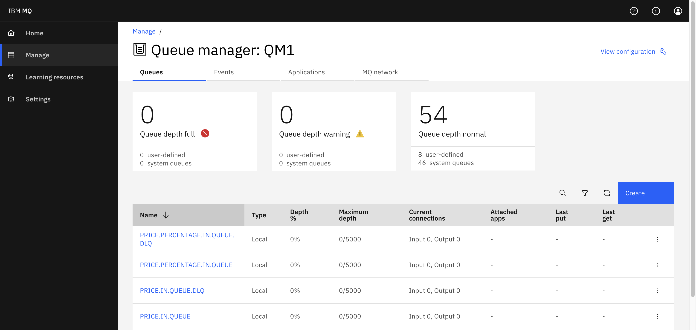
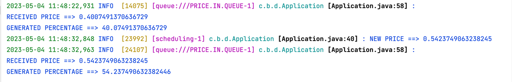
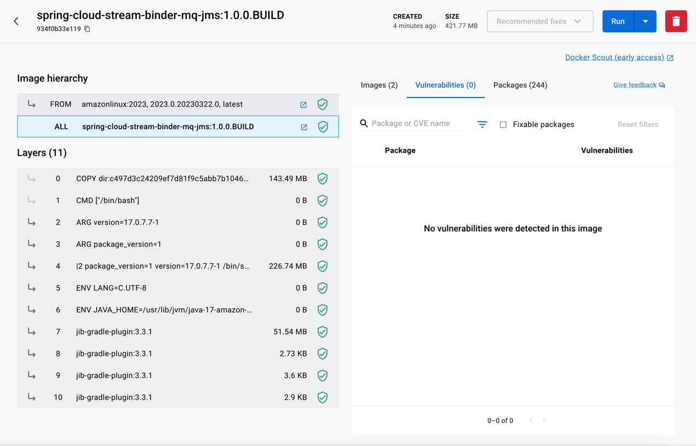
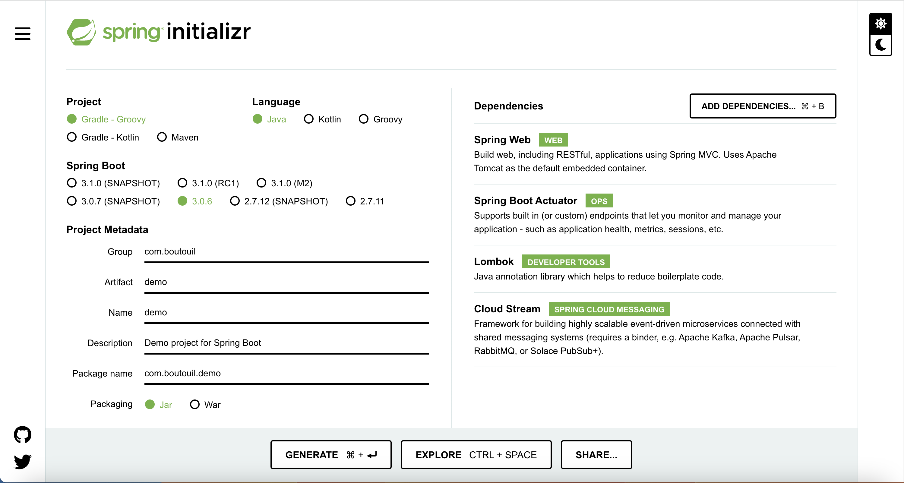

# Spring Cloud Stream Binder MQ JMS Example

A sample project demonstrating the use of the JMS Spring Cloud Stream binder with IBM MQ.

## Prerequisites

* Java 17 and above
* Gradle 8.* and above
* IBM MQ instance [(check local ibm installation section)](#ibm-mq-instance-locally)

#### IBM MQ instance Locally

To run an IBM MQ instance, use the command below, which runs a script written
with [makefile](https://www.gnu.org/software/make/manual/make.html), executing the docker-compose
file [local-compose.yml](docker%2Flocal-compose.yml).

```bash
make local
```

The console interface of IBM MQ can be accessed through <http://localhost:9443/ibmmq/console/>. It can also be used as a
test tool for accessing messages and for managing queues.



## Running the Application

1. Clone the sample project repository:

```bash
git clone https://github.com/mohammedamineboutouil/spring-cloud-stream-binder-mq-jms.git
```

2. Navigate to the project directory:

```bash
cd spring-cloud-stream-binder-mq-jms
```

3. Start your IBM MQ instance if it is not running already.
4. Set the required environment variables for your IBM MQ instance (
   e.g., `IBMMQ_HOST`, `IBMMQ_PORT`, `IBMMQ_USER`, `IBMMQ_PASSWORD`, `IBMMQ_QUEUE_MANAGER`, and `IBMMQ_CHANNEL`).
5. Run the application using Gradle:

```bash
./gradlew bootRun
```

6. Once the application is running, it will start generating random price values and processing them through
   the `priceCalculator` function every 10 seconds. You should see log messages indicating the received price and
   generated percentage in the console.



7. Easily create a secure Docker image of the application using [Jib](https://github.com/GoogleContainerTools/jib) by
   executing the following command:

```bash
./gradlew jibDockerBuild
```



**NOTE:** The generated image contains 0 security vulnerabilities, ensuring a safe and secure deployment.


## Initialize the application

Initialize the Spring Cloud Stream application
through [Spring Initializr](https://start.spring.io/#!type=gradle-project&language=java&platformVersion=3.0.6&packaging=jar&jvmVersion=17&groupId=com.boutouil&artifactId=demo&name=demo&description=Demo%20project%20for%20Spring%20Boot&packageName=com.boutouil.demo&dependencies=web,actuator,lombok,cloud-stream).



### Dependencies

Add the following dependencies to your build.gradle file:

```groovy
// Spring Cloud Stream JMS Binder
implementation "com.boutouil:spring-cloud-stream-binder-jms:$jmsBinderVersion"

// IBM MQ JMS Spring Boot Starter for integration with IBM MQ
implementation "com.ibm.mq:mq-jms-spring-boot-starter:$springMQJmsVersion"
```

For Maven, add these dependencies to your pom.xml file:

```xml

<dependencies>
    <dependency>
        <groupId>com.boutouil</groupId>
        <artifactId>spring-cloud-stream-binder-jms</artifactId>
        <version>${jmsBinderVersion}</version>
    </dependency>
    <dependency>
        <groupId>com.ibm.mq</groupId>
        <artifactId>mq-jms-spring-boot-starter</artifactId>
        <version>${springMQJmsVersion}</version>
    </dependency>
    ...
</dependencies>
```

### Configuration

This section presents the configuration file for the
application, [application.yml](src%2Fmain%2Fresources%2Fapplication.yml). The file contains the IBM MQ environment
variables, Spring Boot application configurations, and Spring Cloud Stream configurations.

The IBM MQ environment variables define the connection details for the IBM MQ server, including the hostname, port,
username, password, queue manager, and channel.

The Spring Boot application and Spring Cloud Stream configurations define the application's name, the bean name of the
function to be used in the application, input and output binding names, and destination queues.

The MQ Spring Boot Configuration section in the file maps the IBM MQ environment variables to the application's
properties.

```yaml
# IBM MQ environment variables
IBMMQ_HOST: localhost          # The hostname or IP address of the IBM MQ server
IBMMQ_PORT: 14140              # The port number on which IBM MQ is listening
IBMMQ_USER: admin              # The username for connecting to the IBM MQ server
IBMMQ_PASSWORD: passw0rd       # The password for connecting to the IBM MQ server
IBMMQ_QUEUE_MANAGER: QM1       # The IBM MQ queue manager name
IBMMQ_CHANNEL: DEV.ADMIN.SVRCONN # The IBM MQ channel name

# Spring Boot application and Spring Cloud Stream configurations
spring:
  application:
    name: spring-cloud-stream-binder-mq-jms  # The application name
  cloud:
    stream:
      function:
        definition: priceCalculator           # The bean name of the function to be used in the application
      bindings:
        price-calculator-out-0: # The output binding name for the price calculator function
          destination: queue://PRICE.IN.QUEUE # The destination queue for the price calculator output
        priceCalculator-in-0: # The input binding name for the price calculator function
          destination: queue://PRICE.IN.QUEUE # The source queue for the price calculator input
        priceCalculator-out-0: # The output binding name for the price calculator function
          destination: queue://PRICE.PERCENTAGE.IN.QUEUE # The destination queue for the price calculator percentage output

# MQ Spring Boot Configuration
ibm:
  mq:
    user: ${IBMMQ_USER}
    password: ${IBMMQ_PASSWORD}
    conn-name: ${IBMMQ_HOST}(${IBMMQ_PORT})
    queue-manager: ${IBMMQ_QUEUE_MANAGER}
    channel: ${IBMMQ_CHANNEL}
```

### Code Example

The code example provided in this section is
from [Application.java](src%2Fmain%2Fjava%2Fcom%2Fboutouil%2Fdemo%2FApplication.java). This file defines the main class
of the application, which is responsible for generating random price values, processing them through the priceCalculator
function, and sending the results to the output channel. The class uses the Spring Boot @EnableScheduling and
@SpringBootApplication annotations, as well as the Lombok @Slf4j and @RequiredArgsConstructor annotations.

The `generatePrices()` method is scheduled to run at a fixed rate of 10 seconds, generating random price values and
sending them to the `PRICE_CALCULATOR_OUT` channel.

The `priceCalculator()` method defines a Function bean that consumes price values from the input channel, calculates a
percentage, and sends the result to the output channel. The input and output channels are defined in the application
configuration as `PRICE.IN.QUEUE` and `PRICE.PERCENTAGE.IN.QUEUE`, respectively.

```java

@Slf4j
@EnableScheduling
@SpringBootApplication
@RequiredArgsConstructor
public class Application {

    private static final Random RANDOM = new Random();
    private static final String PRICE_CALCULATOR_OUT = "price-calculator-out-0";

    private final StreamBridge bridge;

    public static void main(String[] args) {
        SpringApplication.run(Application.class, args);
    }

    /**
     * Generates random price values and sends them to the PRICE_CALCULATOR_OUT channel.
     * This method is scheduled to run at a fixed rate of 10 seconds (10000 milliseconds).
     */
    @Scheduled(fixedRate = 10000)
    public void generatePrices() {
        double value = RANDOM.nextDouble();

        log.info("NEW PRICE ==> {}", value);

        bridge.send(PRICE_CALCULATOR_OUT, value);
    }

    /**
     * Defines a Function bean that consumes price values from the input channel, calculates a percentage, 
     * and sends the result to the output channel. The input channel is defined in the application configuration
     * as PRICE.IN.QUEUE, and the output channel is defined as PRICE.PERCENTAGE.IN.QUEUE.
     *
     * @return a Function that processes Message<String> and produces Message<Double>
     */
    @Bean
    public Function<Message<String>, Message<Double>> priceCalculator() {
        return event -> {
            final var payload = Double.parseDouble(event.getPayload());
            final var result = payload * 100;

            log.info("RECEIVED PRICE ==> {}\nGENERATED PERCENTAGE ==> {}", payload, result);

            return MessageBuilder.withPayload(result)
                    .build();
        };
    }
}
```

## References

- [Spring Cloud Stream Binder JMS](https://github.com/mohammedamineboutouil/spring-cloud-stream-binder-jms): The GitHub
  repository for the Spring Cloud Stream Binder JMS project, which provides an implementation of the JMS binder for
  Spring Cloud Stream applications. This repository is the basis for the example application presented in this README.
- [Spring Cloud Stream Reference Guide](https://docs.spring.io/spring-cloud-stream/docs/current/reference/html/): The
  official reference guide for Spring Cloud Stream, which provides detailed information on core concepts, programming
  models, and application configuration.
- [Spring Cloud Stream Documentation](https://cloud.spring.io/spring-cloud-stream/reference/html/spring-cloud-stream.html):
  An additional source of documentation for Spring Cloud Stream, which provides a comprehensive understanding of the
  framework and its features.

## License

This project is licensed under the terms of the [LICENSE](LICENSE). Please refer to the LICENSE file in this repository
for more information.

## Contact Information

For any inquiries or support, please visit [boutouil.com/contact](https://www.boutouil.com/contact/).
